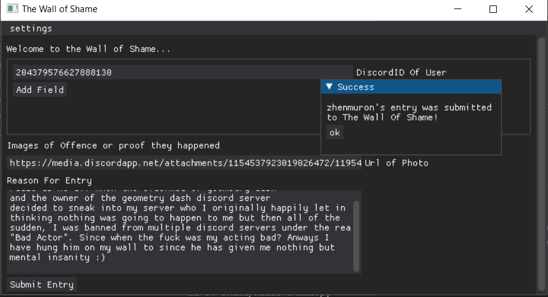
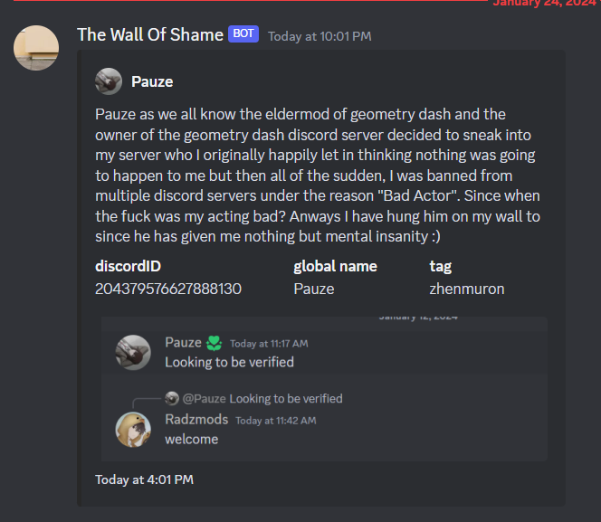

</img>

# The Wall Of Shame
<p>
<a href="https://github.com/psf/black"></a>
<a href="https://discord.gg/dz8xBwRa"></a>
</p>

The Current tool I use to Label Victims who have wronged me.
It has A user interface with Discord Webhook-Styled Functionality and an easy to use user-interface 

Using this tool should be a nobrainer for anyone who is familliar with python and 
all that you need to do provide in the settings is your discord webhook's url. From there 
fill out whatever you need for your server to know about the victim that did you wrong.

And now this version of it is open source. I expect to be adding some more features very soon to it


## Example Entries And User Interface
(Real People Not Actors...)

</img>
</img>


## How to install
```
pip install -r requirements.txt 
```

the following libraries will be installed
- httpx
- discord-webhook
- dearpygui

And that's it. This tool is tiny and only uses one backend api for help which is https://discordlookup.mesavirep.xyz and that's just for reasolving the user information I need so I can hand them off to `The Wall Of Shame`

## Running
```
python wallofshame.py
```

I will compile this library to an executable in pyinstaller very soon for those who don't have python and don't care to install any of this yourself.

## TODOS
- Update the photo in the corner
- Add more features
- compile to .exe
- add workaround discord APIs if the site https://discordlookup.mesavirep.xyz goes down again and if required add Optional Discord API keys to be used...
- add option to ping everyone when a new victim is added


